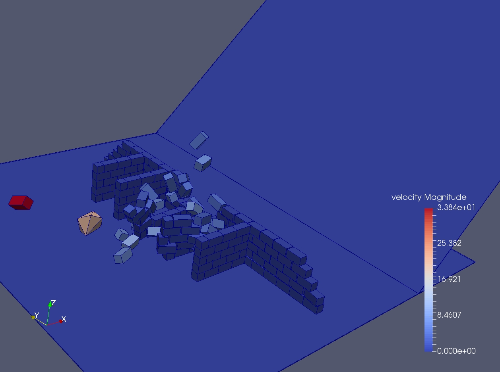

# Some examples involving masonry structures:

## A rock protection masonry wall againt rock fall hazards
   file:

	rock_protection_wall.py

### various configurations inside the scripts
  - pyramid wall
  - wide wall
  - wide wall with buttresses
  - tall wall
  - tall wall with buttresses

### post-processing:

	siconos_vview rock_protection_wall.hdf5
or

	siconos_vexport --global-filter rock_protection_wall.hdf5

	siconos_vexport --global-filter --gen-para-script=6  rock_protection_wall.hdf5 > par.sh