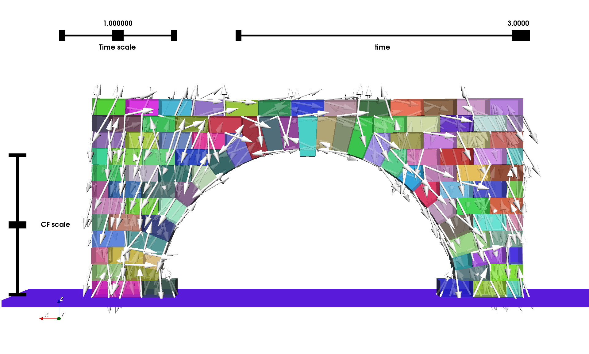

#  LMGC77 examples created by V. Acary in his PhD Thesis (2001)

  This example uses old input files of LMGC77 created by V. Acary in his PhD Thesis (2001)

 

## HowTo for Arches example

-  To parse the LMGC77 input file, run

       python ../lmgc77_utils/parser_lmgc77_2D.py

-  To build 3D brick form 2D Finite element mesh run

     python ../lmgc77_utils/make_3d_brick.py

- to run the simulation

      python arches.py

- to postprocess

     siconos_vexport --global-filter arches.hdf5

     siconos_vview --normalcone-ratio=0.01 --cf-scale=0.2 arches.hdf5

     siconos_vexport --global-filter --gen-para-script=6  arches.hdf5 > par.sh;
     
## Issues to be corrected

  We use convex hull for building the brick. Some of bricks are not convex. 